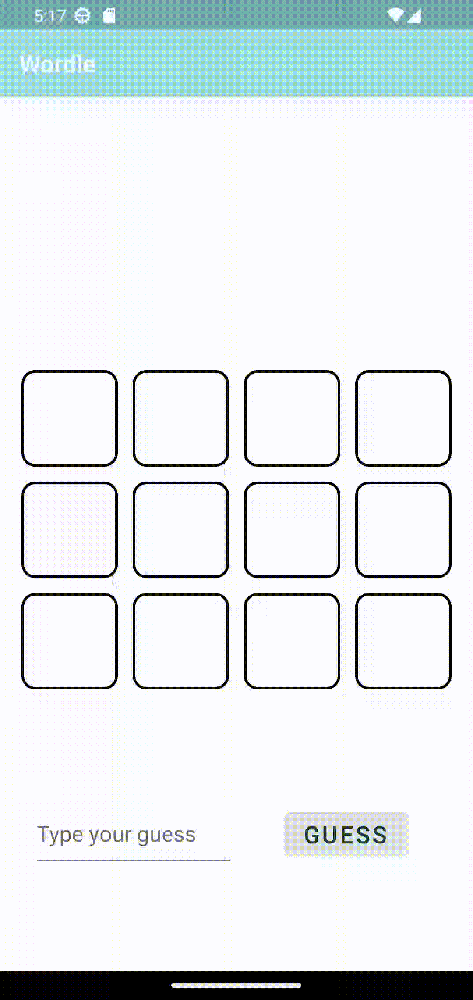

# Android Project 1 - *Wordle*
Submitted by: **Kamila Aripova**

**Wordle** is an android app that recreates a simple version of the popular word game [Wordle](https://www.nytimes.com/games/wordle/index.html).

Time spent: **5** hours spent in total

## Required Features

The following **required** functionality is completed:

- [x] **User has 3 chances to guess a random 4 letter word**
- [x] **After 3 guesses, user should no longer be able to submit another guess**
- [x] **After each guess, user sees the "correctness" of the guess**
- [x] **After all guesses are taken, user can see the target word displayed**

The following **optional** features are implemented:

- [x] User can see the 'correctness' of their guess through colors on the word
- [x] User sees a visual change after guessing the correct word
- [x] User cannot input an invalid guess

## Video Walkthrough

Here's a walkthrough of implemented user stories:

' title='Win Walkthrough' width='' alt='Win' />
' title='Lose Walkthrough' width='' alt='Lose' />

## License

    Copyright [2023] [Kamila Aripova]

    Licensed under the Apache License, Version 2.0 (the "License");
    you may not use this file except in compliance with the License.
    You may obtain a copy of the License at

        http://www.apache.org/licenses/LICENSE-2.0

    Unless required by applicable law or agreed to in writing, software
    distributed under the License is distributed on an "AS IS" BASIS,
    WITHOUT WARRANTIES OR CONDITIONS OF ANY KIND, either express or implied.
    See the License for the specific language governing permissions and
    limitations under the License.